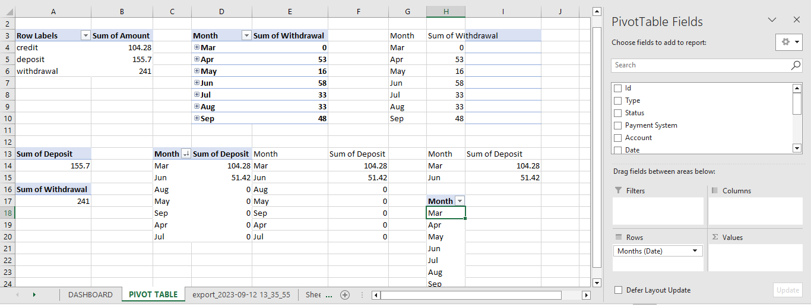
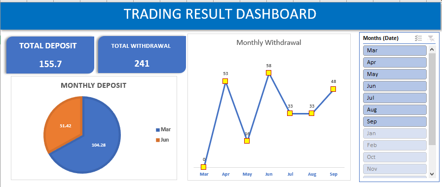

# My-Forex-Trading-Analysis

##  Introduction
### ** _My Trading Record_**
This work is an Excel project centered around my personal trading history. I obtained the necessary data by downloading a CSV file from Cabana Capitals website, a forex brokerage firm.
## **_Obective of the Project_**
The objective of this project is to conduct a comprehensive analysis of my trading performance. By extracting valuable insights from the data, the goal is to establish a reliable method for tracking overall trading progress and facilitating informed, data-driven decision-making.

## **_Disclaimer_** :
_The datasets and reports presented herein accurately reflect my trading records. I undertook this project as a means to assess and enhance my proficiency in data cleaning, pivot tables, Excel functions, and data visualization skills._

## Skills/concepts demonstrated:
1.	Excel skills: removing duplicates, pivot, visualization.

## Problem Statement:
1. Show the deposits made during the months? 
2. Show the withdrawals made during the months? 
3. Show total deposits
4. Show total withdrawals

## Analysis:
**Cleaned and Organized Table**

I cleaned the data by adding two columns (withdrawal and deposit) and then formatted it in a well organized tabulated form.

**Pivot_tables**

I used pivot tables to get the variables needed for visualization in creating my kpi and my charts.📊

## Visualization

The report comprise of a dashboard with 2 kpi's indicating total deposits and total withdrawals and a month slicer as a filter. Going further, it displays two visuals, a pie chart showing the amounts of deposits made for the two months and the line chart showing the amount of withdrawals made in the respective months.😄

## Conclusion and Rcommendations
As a forex trader, i recommend a careful trading  system with proper risk management and and also i recommend less withdrawal to grow the account for better withdrawals.📈📈
